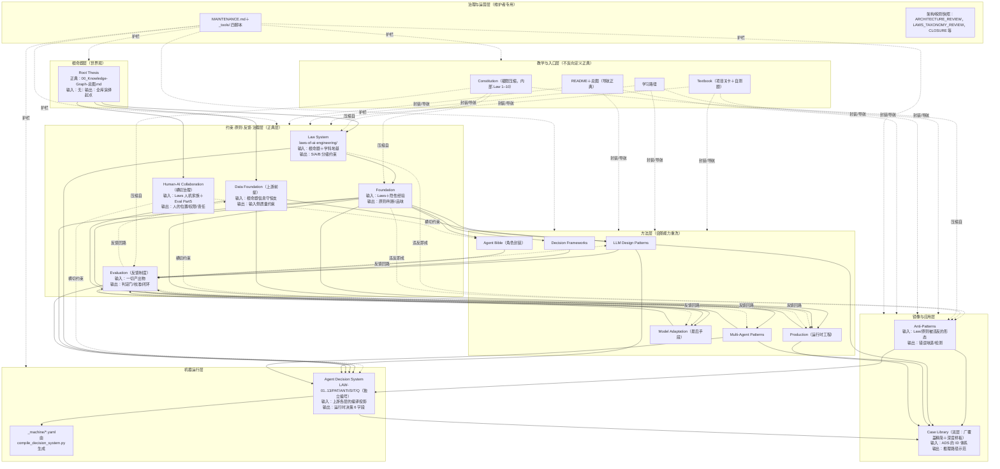

# Fable 5 · 全局架构收束 Review

> 审查方式：通读 `README.md`、`00_Knowledge-Graph-总图.md`、`ARCHITECTURE_REVIEW.md`、`LAW_REFERENCE_SYSTEM_CLOSURE.md`、`LAWS_TAXONOMY_REVIEW.md`、`LAWS_REWRITE_GRAND_PLAN.md`、`MAINTENANCE.md`、Laws 四个治理页、ADS 协议、案例库 INDEX、学习路径与 Constitution 的收束段；程序化核验体检状态（11 项全绿）、`_machine` 编译新鲜度（laws.yaml 晚于全部 ADS md 修改）、三套编号的声明落点。本轮不改文件、不重开 Law Reference System。

---

## 1. 一句话判断

**这套 KB 的架构已经收束到"终局形态清晰、剩余工作是贴标签而非动骨架"的程度——五层结构（根命题→约束/原则/反馈→方法→镜像/应用→机器投影）成立且有治理文件背书，真正残留的架构债只有三类：任务队列碎片化在三处治理文件里、顶层入口被治理文档稀释、以及少数"升位/定调已在总图落地但还没回写到 README 与各书 INDEX"的半程同步。**

---

## 2. 当前 KB 的终局图像

这套 KB 的终局不是"一套丛书"，而是**一条可追溯的判断编译链**：

```text
Root Thesis（不可靠部件→可靠系统；生成廉价→验证稀缺）
  → 约束层（Law System：Core Laws S18 / family A42 / contextual B42）
  → 原则与判断层（Foundation）＋ 反馈制度（Evaluation）＋ 横切治理（Human-AI）＋ 上游前提（Data）
  → 方法层（Design Patterns / Multi-Agent / Decision Frameworks / Agent Bible / Model Adaptation / Production）
  → 镜像层（Anti-Patterns）＋ 应用层（Case Library 双层结构）
  → 机器投影（Agent Decision System + _machine YAML）
  → 教学封装（Textbook / 学习路径 / Constitution 压缩版）
```

终局状态的五个特征，当前达成度：

1. **每层有唯一正典、层间有显式桥**——基本达成（见第 5 节 SoT 地图，冲突极少）。
2. **三套编号空间隔离且各有声明**——已达成（`00_REFERENCE-POLICY.md` 三套编号表、Constitution L28 编号边界 callout、README Law System 口径 callout）。
3. **重复只存在于"不同层级职责"处**——已达成（Constitution 十条 / 教学七条 / Core Laws S18 是三层压缩，`laws-of-ai-engineering/00_INDEX.md`"核心正典与全书目录的关系"段已桥接）。
4. **结构不再靠人肉维持**——已达成（`_tools/kb_health_check.py` 11 项检查含 Laws alias/heading 语义一致性与 metadata schema；`MAINTENANCE.md` 定义改动类型与权限）。
5. **任务有唯一活队列、治理文档有生命周期标注**——**未达成**，这是本轮识别的主债（问题 1/2/3）。

应该收束的：任务队列、顶层文件地图、半程同步项（Human-AI 在 README 的呈现、Evaluation 的自我定位、老方法书对 Data 前提的承认）。

应该保留张力的：Foundation/Laws 的分工模糊带（constraints vs judgment，AR 风险 3 的判断正确——标注分工、不切一刀）；三层核心清单并存；Anti-Patterns 与 Laws 的"违反即反模式"镜像关系；教学七条与 S18 的受众分裂。

---

## 3. 全局 Mermaid 架构图



读图要点：实线是"派生/输入"，虚线是"横切/反馈/压缩/护栏"。与 `ARCHITECTURE_REVIEW.md` 第 3 节的架构师版本一致，仅两处显式化：治理运营层（L6）作为独立层出现——它已经事实存在（7 个顶层治理文件 + 4 个脚本），不承认它就无法治理它；`_machine` YAML 作为 ADS 的编译产物单列——它是"md 为正典、机器格式为投影"纪律的落点。

---

## 4. 模块职责表

| 模块 | 不可替代职责 | 与谁重叠 | 重叠判定 | 层级归属 |
|---|---|---|---|---|
| 总图＋README | 唯一导航正典＋演绎树 | ARCHITECTURE_REVIEW 的架构图 | 有价值：AR 是依据快照（已有 Batch 6 note 声明），总图是正典视图。冻结 | 教学/入口层（导航正典） |
| Constitution | 20 页极限压缩，自包含入口 | Laws（十条 vs 102 条）、Core Laws | 有价值的三层压缩，编号边界 callout（L28）已桥接。冻结 | 教学层（压缩正典） |
| **Laws（Law System）** | 全库唯一约束库：102 条 + S/A/B 分级 + 4 治理页 | Foundation（原则）、Constitution | 保留张力：Laws=constraints、Foundation=judgment（AR 风险 3 判定正确） | **正典层核心** |
| Foundation | 隐性知识/判断/稀缺性转移的唯一正典 | Laws | 同上，分工已声明（Foundation INDEX 指向 Laws 正典） | 正典层 |
| Evaluation | 全库反馈制度：判定门、校准、评价者被评价 | 各书的验收清单、ADS Q-01..10 | 有价值：书=理论正典，各书清单=应用，Q=运行时投影。缺自我定位声明（问题 7） | 正典层（反馈制度） |
| Data Foundation | 输入侧上游前提（信息守恒的工程化） | Evaluation（输入/输出镜像） | 有价值的镜像，双方 INDEX 已互认 | 正典＋方法层（上游） |
| Human-AI Collaboration | 横切治理层：人的位置/权限/责任/信任 | Laws 人机家族、Eval Part5、Production 审批 | 有价值：定律→协作设计→运行时的三级展开。README 呈现未升位（问题 6） | 横切治理层 |
| LLM Design Patterns | 单体推理/推断组织的方法正典 | Multi-Agent（5 模式） | 已收束：正典声明按事实分工落地（编排类正典在 MA） | 方法层 |
| Multi-Agent Patterns | 多体协调拓扑的方法正典＋有罪推定纪律 | Design Patterns | 同上，已收束 | 方法层 |
| Decision Frameworks | 人/Agent 的取舍工具箱（27 框架） | Laws 经济家族（R4） | 有价值：工具 vs 定律 vs 隐性判断三层，审计 R4 已判定保留 | 方法层 |
| Agent Bible | 21 个可抄角色规格（Prompt×Memory×工具×评估） | ADS 的 PAT/SIT | 轻度重叠未声明（问题 17）：圣经=构建期模板，ADS=运行期决策 | 方法层（应用模板） |
| Model Adaptation | 优化阶梯最后一级的守门人 | Production Part（部署侧） | 已声明分工（模型本体 vs 系统运行） | 方法层 |
| Production | 运行时工程：200 OK ≠ 正确 | Model Adaptation、Data Part4、HAI | 三处接口都已在 INDEX 显式声明。健康 | 方法层（运行时） |
| Anti-Patterns | 方法层负空间：违反 Law/原则的形态目录 | Laws（根因）、ADS ANTI-01..12 | 有价值镜像；ANTI 编号是运行时投影（12 个检测器 ≠ 102 反模式），勿混 | 镜像层 |
| Case Library | 推理路径示范＋ADS 的反向训练集 | 各书的案例字段 | 有价值：唯一以 ADS ID 为主索引的应用层。双层结构需定稿声明（问题 9） | 应用层 |
| **Agent Decision System** | 全库唯一机器运行正典：独立编号空间＋YAML 投影 | Constitution（同为压缩） | 有价值：宪法压缩给人、ADS 编译给机器，受众不同 | 机器运行层 |
| Textbook＋学习路径 | 零基础到专家的封装＋三条读者路径 | 一切（它封装一切） | 有价值，且已声明不反向定义正典（学习路径 L14 Law System 口径） | 教学层 |
| MAINTENANCE＋_tools | 维护护栏与验收器 | REFERENCE-POLICY 的操作段 | 轻度重叠（问题 14）：工具清单该归口 MAINTENANCE | 治理运营层 |
| 治理快照（AR/TAXONOMY/CLOSURE/GRAND_PLAN/AUDIT/CANDIDATES） | 架构决策的依据与停手机制 | 01_编辑审计（队列） | **需收束（问题 1/2/3）**：快照有价值，但队列必须归一 | 治理运营层（快照） |

---

## 5. Source of Truth 地图

| 概念/判断 | 正典文件 | 其他相关文件 | 是否存在冲突 | 建议 |
|---|---|---|---|---|
| AI Engineering 根命题 | `00_Knowledge-Graph-总图.md`（根命题＋演绎树） | Constitution 序言、README 一句话总纲、AR §2.1 | 无（三处为同一句的压缩/转述） | 冻结 |
| "验证比生成稀缺" | `laws-of-ai-engineering/02_计算与验证定律.md#Law 12` | Constitution Law 1（压缩版）、Foundation、ADS LAW-01 | 无（层级投影已声明） | 冻结 |
| 哪些 Law 是全库核心 | `laws-of-ai-engineering/00_CORE-LAWS.md`（S18） | Laws INDEX"教学七条"、TAXONOMY_REVIEW | 无实质冲突（INDEX"核心正典与全书目录的关系"段已桥接：七条=学习者版，S18=治理版） | 冻结；**不要出现第四张核心清单** |
| Laws 引用规则 | `laws-of-ai-engineering/00_REFERENCE-POLICY.md` | CLOSURE（停手机制）、CORE-LAWS 引用原则段 | 无 | 冻结 |
| Law 间关系/可否合并 | `laws-of-ai-engineering/00_LAW-RELATION-GRAPH.md` | TAXONOMY_REVIEW | 无 | 冻结 |
| 三套编号的边界 | `00_REFERENCE-POLICY.md` 三套编号表 | Constitution L28 callout、README L14 callout、PROTOCOL | 无 | 冻结 |
| Agent 运行时怎么决策 | `agent-decision-system/00_PROTOCOL.md`（＋01 路由器） | Constitution（人读版）、_machine YAML | 无 | 冻结；LAW-xx→源 Law 对照是唯一缺口（问题 5） |
| 案例如何调用知识体系 | `ai-engineering-case-library/00_INDEX.md`（ADS ID 为主索引） | REFERENCE-POLICY"案例库不做 Laws 注释本"条 | 无 | 补"双层结构为终局"一句（问题 9） |
| 学习者该怎么读 | `02_学习路径与未来扩展.md` | README 三条路径表、教材 INDEX 使用方法 | 无（README 表是路径文档的摘要） | 冻结 |
| 全库架构的正典视图 | `00_Knowledge-Graph-总图.md` | `ARCHITECTURE_REVIEW.md`（依据快照，已有状态 note） | 无 | 冻结 |
| 维护规程与改动权限 | `MAINTENANCE.md` | REFERENCE-POLICY 操作段、CLOSURE 标准流程 | 轻微：工具清单散在三处 | MAINTENANCE 补全 4 脚本清单并回链（问题 14） |
| **活任务队列** | 名义上 `01_编辑审计.md#待办清单`（自称"唯一正典位置"） | GRAND_PLAN 批次、CLOSURE 61 候选、CANDIDATES | **有冲突——四处队列并存** | 本轮最高优先收束（问题 1/2） |
| 结构健康的判定 | `_tools/kb_health_check.py`（11 项） | MAINTENANCE"必跑命令" | 无 | 冻结 |
| 人在系统中的位置 | `human-ai-collaboration-foundation/00_INDEX.md` | Laws 09 家族（定律正典）、Production | 无（三级展开已互认） | 冻结 |

---

## 6. 最重要的 20 个架构问题

按"影响全局理解/Agent 调用 > 教学与维护 > 增强"排序。前 3 个是真正的债，其余多为半程同步与冻结确认。

**1 · 任务队列碎片化（最高优先）**
涉及：`01_编辑审计.md#待办清单`、`LAWS_REWRITE_GRAND_PLAN.md`（后续批次）、`LAW_REFERENCE_SYSTEM_CLOSURE.md`（61 中确信度候选）、`LAW_REFERENCE_REMAINING_CANDIDATES.md`。
为什么是架构问题：待办清单自称"唯一正典位置"，但 Laws 治理轮产生了三个各自带队列的文件——后续 Agent 无法回答"下一件事是什么"，这正是本库自己诊断过的"自描述漂移"在任务层的复发。
动作：**收束**——编辑审计待办为唯一活队列；三个治理文件的队列段各加一行"执行状态以编辑审计待办清单为准"，其中可执行残留（61 候选按主题分批、GRAND_PLAN 未完批次）登记为待办条目。
风险：低（纯登记，不动内容）。
验收：全库 grep"待办/后续/批次"，指向执行的段落都能回链到编辑审计；待办清单含 Laws 治理残留条目。

**2 · "见 Law N"待办项已被 Reference System 实质取代但未更新**
涉及：`01_编辑审计.md` L191 待办项、`LAW_REFERENCE_AUDIT.md`（已完成盘点）、`00_REFERENCE-POLICY.md`（已禁止机械统一）。
为什么是架构问题：该待办按旧口径（"统一为见 Law N"）表述，而新正典（Reference Policy）明确禁止全库机械替换——留着旧表述，下一个 Agent 可能按旧口径执行，直接违反新政策。
动作：**改写**该待办项——标注"原任务已被 Law Reference System 取代（见 CLOSURE）；残留 = 按 Reference Policy 处理 61 中确信度候选，分主题批次"。
风险：低。验收：待办清单无与 Reference Policy 冲突的表述。

**3 · 顶层入口被治理文档稀释**
涉及：`README.md`、顶层 14 个 md（含 7 个治理/审阅文件）。
为什么是架构问题：README 是"无歧义导航"正典，但打开文件夹的读者/Agent 面对 ARCHITECTURE_REVIEW、LAWS_TAXONOMY_REVIEW、CLOSURE、GRAND_PLAN、AUDIT、CANDIDATES、MAINTENANCE、FABLE5_×2 时没有任何分类信号——知识、治理依据、审阅快照、操作规程混在一层。
动作：**补桥接页**（不迁移文件——移动 = 断链风险 + git 历史断裂，成本大于收益）：README 加"文件地图"小节，三行分类：读者看书架、维护者看 MAINTENANCE、治理依据/快照清单（标注"非知识正文"）。
风险：低。验收：README 有文件地图；新读者可在 30 秒内判断哪些文件可以忽略。

**4 · LAW-01..13 与源 Law 无逐条对照**
涉及：`agent-decision-system/04_LAW-INVARIANTS.md`、`00_PROTOCOL.md` SOURCE MAP、`00_CORE-LAWS.md`（模块级表）。
为什么是架构问题：编号隔离已声明，但"隔离"不等于"不可追溯"——一个 Agent 拿着 LAW-08 想深挖时，没有机械路径到 Law 84/95；CORE-LAWS 的模块表是书级不是条级。这是判断编译链上唯一断开的可追溯环节。
动作：**补桥接**——04 每张卡加一行 `SOURCE: Law N（含 heading 链接）`，或 PROTOCOL SOURCE MAP 细化为 13 行对照表；改后重跑 compile 使 YAML 带 source 字段。
风险：低-中（动正典层文件，但只加字段不改定义；MAINTENANCE 口径下属"结构修复+机器格式"）。
验收：13 条 invariant 各有源 Law 链接；`compile_decision_system.py` 通过且 YAML 含对照；体检通过。

**5 · Human-AI 横切层升位只完成一半**
涉及：`README.md`（⑫ 仍列"补充书"无横切标注）、`00_Knowledge-Graph-总图.md`（已升位，L149 括注）、AR 风险 4。
为什么是架构问题：总图与 README 对同一模块给出不同层级信号，两个导航正典打架。
动作：**收束**——README ⑫ 条目补"（横切治理层）"标注；不重排书号（⑫ 已被引用）。
风险：低。验收：README 与总图对 Human-AI 的层级表述一致。

**6 · Evaluation 的"反馈制度"地位未自我声明**
涉及：`evaluation-of-ai-systems/00_INDEX.md`、总图 framework 句（已表述为"判断闭环"）、AR 风险 6。
为什么是架构问题：AR 已判定 Evaluation 是"全库反馈回路而非第三本书"，总图已部分体现，但 Evaluation 自己的 INDEX 未声明这个全局角色——模块自我认知落后于全局定位。
动作：**收束**——Evaluation INDEX 加一段定位声明（含方法层三问：如何被检验/失败如何进 Anti-Patterns/成功如何进 Case Library）。
风险：低。验收：三处（总图/AR/Eval INDEX）表述一致。

**7 · 老方法书对 Data Foundation 前提的反向承认不完整**
涉及：`llm-design-patterns/00_INDEX.md`、`multi-agent-patterns-handbook/00_INDEX.md`、`agent-bible/00_INDEX.md`、`decision-frameworks-guide/00_INDEX.md`；AR §2.2 已点名此检查。
为什么是架构问题：Data 被定位为"一切方法的上游前提"，新书（Model Adaptation/Production）都承认了，四本老方法书的 INDEX 没有——上游地位只在图上成立，不在引用结构里成立。
动作：**补桥接**——各 INDEX 一行"本书方法的输入质量前提见 Data Foundation"（一行，不重写）。
风险：低。验收：四书 INDEX 各含一处指向；不新增正文改写。

**8 · 案例库"双层结构"定调未落到正典文件**
涉及：`ai-engineering-case-library/00_INDEX.md`（已有"深度版案例"说明但未声明双层为终局）、`01_编辑审计.md` 待办"其余 95 案深度化（每类 1-2 个）"、AR 风险 5。
为什么是架构问题：AR 判定"广覆盖精简层＋少量深度样板"是终局设计而非过渡态；待办措辞仍隐含"深度化是未完成的债"。定调不落正典，后续 Agent 会把 95 案全部扩深——AR 明确说这会破坏应用层价值。
动作：**收束**——case INDEX 声明双层结构为终局；待办措辞同步（"按需再升级个别样板"而非"其余 95 案"）。
风险：低。验收：两处表述一致，"深度化"不再是默认待办。

**9 · 三层核心清单并存（确认冻结，防回退）**
涉及：Constitution 十条、`laws-of-ai-engineering/00_INDEX.md` 教学七条、`00_CORE-LAWS.md` S18。
为什么是架构问题：三张"核心"清单是最容易被后续 Agent"优化合并"的目标——而它们是三层受众（快速入门/学习者/维护者）的合法压缩，桥接段已存在。
动作：**保留**（这是有价值的多视角重复的典型）。唯一动作：待办清单加一条"禁止合并三张核心清单"的负面约束，或并入第 8 节不应做清单。
风险：不动为零。验收：三清单与桥接段原样保留。

**10 · 01_编辑审计的体裁膨胀**
涉及：`01_编辑审计.md`（原始审计 R/C/M/H ＋ 逐项状态更新 ＋ 修复轮记录 ＋ 待办清单，四种体裁一个文件）。
为什么是架构问题：文档职责漂移——它从"一次诚实的自我审视"长成"审计+变更日志+backlog"三合一，找任何一段都要滚动全文；且它是全库被链接最多的图谱层文件之一。
动作：**保留但声明**——文件头加一段"本文三段结构：审计正典（不再改）/状态注记/修复轮记录与待办（活动区）"。不拆文件（拆 = 断内链，收益不够）。
风险：低。验收：头部结构声明存在，三段边界清晰。

**11 · MAINTENANCE 工具清单不全**
涉及：`MAINTENANCE.md`（只列 2 个脚本）、`00_REFERENCE-POLICY.md` 与 `CLOSURE`（各自描述 upgrade/audit 两脚本）。
为什么是架构问题：MAINTENANCE 是操作正典，但四个 `_tools/` 脚本的完整清单和分工只能拼三个文件才能获得。
动作：**收束**——MAINTENANCE 补全脚本清单（体检/编译/升级/审计四件），每件一行用途＋回链详细文档。
风险：低。验收：MAINTENANCE 是工具的单一入口。

**12 · 61 个中确信度候选无 owner 无节拍**
涉及：`LAW_REFERENCE_SYSTEM_CLOSURE.md`（"未来按主题慢慢处理"）、`LAW_REFERENCE_REMAINING_CANDIDATES.md`。
为什么是架构问题："慢慢处理"没有归宿会变成永久悬置或被反复重新发现；CLOSURE 同时声明了停手机制，两者需要在队列里共存。
动作：**迁移**——按 CLOSURE 建议的三个主题（Anti-Patterns 安全可靠性/Evaluation 统计/HAI 责任边界）登记为三个待办条目（🟡 档：便宜模型提案+强模型裁决），并注明停手条件。与问题 1 合并执行。
风险：低。验收：候选处置有队列条目、有档位、有停手条件。

**13 · Agent Bible 与 ADS 的关系未声明**
涉及：`agent-bible/00_INDEX.md`、`agent-decision-system/00_PROTOCOL.md`。
为什么是架构问题：两者都封装"判断"——圣经是构建期角色模板，ADS 是运行期决策协议；一个 Agent 同时读到两者时没有优先级指引（例：决策者 Agent 的 prompt vs SIT-14 的路由）。
动作：**补桥接**——圣经 INDEX 一句："本书是构建期模板；运行时决策以 ADS 为操作正典，二者编号与职责不互替。"
风险：低。验收：一句声明，无正文改动。

**14 · stability 字段试点未定去留**
涉及：`laws-of-ai-engineering/*.md`（有）、其余 130+ 文件（无）、`00_METADATA-SCHEMA.md`。
为什么是架构问题：半覆盖的元数据字段比没有更糟——使用者无法判断"没有 stability"意味着"低稳定"还是"未标注"。
动作：**收束（定边界而非铺开）**——在 METADATA-SCHEMA 或 MAINTENANCE 声明：stability 仅用于规律/正典层（Laws＋治理页），其余层以 abstraction_layer 的保值期语义为准。
风险：低。验收：字段边界有声明；体检不要求全库覆盖。

**15 · 顶层命名三制并存**
涉及：数字前缀中文（00/01/02_）、全大写英文蛇形（7 个治理文件）、FABLE5_ 前缀（审阅快照）。
为什么是架构问题：命名是最便宜的分层信号，当前三种 convention 恰好对应三种职责但从未被声明——这个巧合应该被固化为规则而非留给猜测。
动作：**保留存量＋声明规范**——MAINTENANCE 加命名规范三行（知识=数字中文、治理=大写英文、审阅快照=署名前缀）；不重命名任何存量文件。
风险：不动存量为零。验收：规范入 MAINTENANCE；新文件遵守。

**16 · 学习路径未来扩展与待办清单的 M3/M5 双挂**
涉及：`02_学习路径与未来扩展.md` 第四节、`01_编辑审计.md` 待办。
为什么是架构问题：同一件未来事项在叙事文档和执行队列各挂一份，完成时需要两处同步（本轮 Production 完成时就同步了两处——证明这个成本是真实的）。
动作：**保留双挂但定主从**——学习路径条目加"执行状态以编辑审计待办为准"一句。
风险：低。验收：主从声明存在。

**17 · 教学资产未接入学习路径**
涉及：`02_学习路径与未来扩展.md`、教材 12 章自测题、Case 1/11/21/41/51 深度版。
为什么是架构问题：教学层的两类新资产（自测、深度案例）没有进入"怎么读"的正典，学习者按路径走会错过它们。
动作：**补桥接**——路径 A/B 各加一句（A：每章自测题过关再前进；B：先读五个深度案例建立"完整判断长什么样"）。
风险：低。验收：路径文档含两处指引。

**18 · _machine YAML 缺命名空间元声明**
涉及：`agent-decision-system/_machine/*.yaml`、`_tools/compile_decision_system.py`。
为什么是架构问题：YAML 里的 `LAW-xx` 引用对人类有 REFERENCE-POLICY 解释，对直接消费 YAML 的程序没有——机器格式应自带"本编号空间为 ADS 运行时编号，非 Laws 1-102"的头部声明。
动作：**收束**——编译器在每个 YAML 头部注释加 namespace 声明（改脚本一处，重编译）。
风险：低。验收：YAML 头部含声明；编译与体检通过。

**19 · Constitution 的"十条定律"章名与 Law System 口径（确认冻结）**
涉及：`The-Constitution-of-AI-Engineering.md` 第一章。
为什么列入：这是后续 Agent 最可能"顺手统一"的地方——把宪法十条改编号对齐 Laws。L28 编号边界 callout 已完整解决歧义。
动作：**保留**，列入不应做清单。
风险：不动为零。验收：宪法内部编号原样。

**20 · 治理快照文件缺生命周期标注**
涉及：`ARCHITECTURE_REVIEW.md`（有 Batch 6 note，最佳实践）、`LAWS_TAXONOMY_REVIEW.md`（有执行状态 note）、`LAWS_REWRITE_GRAND_PLAN.md`、`LAW_REFERENCE_AUDIT.md`（有 Batch 6 note）、`LAW_REFERENCE_REMAINING_CANDIDATES.md`（可重生成）。
为什么是架构问题：AR 和 TAXONOMY 已带状态 note，但 GRAND_PLAN 没有——读者无法判断它是"待执行计划"还是"已执行的历史依据"。快照类文件的头部状态标注应成为惯例。
动作：**收束**——GRAND_PLAN 头部补状态 note（哪些批次已完成、剩余部分归入待办）；惯例写进 MAINTENANCE。
风险：低。验收：五个快照文件都有状态 note。

---

## 7. P0 / P1 / P2 下一轮优化计划（一个 Agent · 3 天）

### P0（第 1 天：全局理解与 Agent 调用）

**P0-1 · 任务队列归一**（问题 1/2/12/16）
涉及：`01_编辑审计.md`、`LAWS_REWRITE_GRAND_PLAN.md`、`LAW_REFERENCE_SYSTEM_CLOSURE.md`、`02_学习路径与未来扩展.md`。
为什么值得：这是唯一会让后续所有工作走错方向的债——队列不归一，每个新 Agent 都要重新考古"下一件事是什么"。
自动化：低（登记与改写措辞是判断活）。人工判断：需要（61 候选的主题分批、旧待办的取代关系）。
完成标准：待办清单成为唯一活队列（含 Laws 残留三批＋停手条件）；三个治理文件队列段回链；"见 Law N"旧表述改写；体检通过。
不应做：不处理任何一个候选本身；不删治理文件的历史内容。

**P0-2 · README 文件地图＋Human-AI 升位补全**（问题 3/5）
涉及：`README.md`。
为什么值得：README 是人与 Agent 的第一入口，当前对 14 个顶层文件无分类信号、对 Human-AI 的层级与总图不一致。
自动化：否（一次性人工写）。完成标准：文件地图三分类存在；⑫ 带横切标注；与总图口径一致；不重排书号。
不应做：不迁移、不重命名任何文件。

**P0-3 · LAW-01..13 源 Law 对照＋YAML namespace**（问题 4/18）
涉及：`agent-decision-system/04_LAW-INVARIANTS.md`（或 PROTOCOL SOURCE MAP）、`_tools/compile_decision_system.py`、`_machine/*.yaml`。
为什么值得：补上判断编译链最后一段可追溯性，同时不破坏编号隔离——这是"Agent 可调用层"的收官。
自动化：半（对照表人工定一次，编译全自动）。人工判断：13 行映射需要（对照 CORE-LAWS 模块表即可完成大半）。
完成标准：13 条各有源 Law heading 链接；YAML 带 source 与 namespace 声明；compile＋体检通过。
不应做：不改任何 invariant 的定义文本；不给 ADS 增加第 14 条。

### P1（第 2 天：教学/维护/复用价值）

**P1-1 · 半程同步四件套**（问题 6/7/8/13）：Evaluation INDEX 反馈制度声明；四本老方法书 INDEX 各一行 Data 前提；case INDEX 双层终局声明＋待办措辞同步；Agent Bible↔ADS 一句桥接。均为 INDEX 级一段/一行，不动正文。自动化：否。完成标准：每处一段、体检通过、与总图/AR 口径一致。不应做：不重写任何书的正文章节。

**P1-2 · MAINTENANCE 收官**（问题 11/15/20/14）：工具四件清单、命名规范三行、快照状态 note 惯例＋给 GRAND_PLAN 补 note、stability 边界声明。自动化：否（半天人工）。完成标准：MAINTENANCE 成为运营层单一入口。不应做：不重命名存量文件。

### P2（第 3 天：增强）

**P2-1 · 61 候选第一主题批**（问题 12 的执行首批）：Anti-Patterns 安全/可靠性类约 20 条——按 Reference Policy 逐条裁决"升级 heading / 保留文件级 / 不动"，用 `upgrade_law_wikilinks.py` 白名单机制执行。自动化：半。人工判断：每条都要。完成标准：该主题批清零、audit 脚本重新生成剩余清单、`changed_links=0` 后停手。不应做：不为清零而改（CLOSURE 停手机制优先）。

**P2-2 · 教学资产接入**（问题 17）＋**核心清单冻结备忘**（问题 9/19 入不应做清单）。完成标准：学习路径两处指引；负面约束入档。

三天总原则：全部改动走 MAINTENANCE 的"结构修复"通道，每批跑 `kb_health_check.py`，涉 ADS 必跑 compile，git 按批提交。

---

## 8. 不应做的事

1. **不要把 102 条 Laws 都升格为全局公理**——S/A/B 分层是本轮最大架构成果（`00_REFERENCE-POLICY.md`），任何"补全引用"的冲动都要先过它。
2. **不要把案例库改成 Laws 注释本**——案例的主索引是 ADS ID（`ai-engineering-case-library/00_INDEX.md`），Policy 明文禁止。
3. **不要混用三套编号**——`Law 1–102`、Constitution 内部 `Law 1–10`、ADS `LAW-01–13` 已各有声明；补对照表≠统一编号。
4. **不要为减少重复而删除不同层级的重复**——Constitution 十条/教学七条/Core Laws S18 是三层受众的合法压缩；反思四处、决策原则三处同理（审计 R3/R4）。
5. **不要把教学入口反向当正典来源**——教材/README 的简化表述与正典冲突时，改教学层的表述或加桥接，不改正典。
6. **不要重开 Law Reference System**——CLOSURE 已定停手机制（`changed_links=0` 即停）；61 候选是内容判断队列，不是系统债。
7. **不要把 61 个中确信度候选当 bug 清零**——低确信度 158 条本来就该保持文件级链接。
8. **不要为"整洁"迁移或重命名顶层治理文件**——断链成本与历史断裂大于收益，用 README 文件地图替代物理整理。
9. **不要给 Agent Decision System 增肥**——13 条 invariant 的克制是它的价值；不要把 S18 全部塞进运行时（CORE-LAWS 已警告）。
10. **不要把 95 个精简案例全部深度化**——双层结构是终局设计（AR 风险 5），广覆盖精简层是特性不是欠账。
11. **不要统一治理文档与知识正文的文风**——快照的英文命名、报告体、状态 note 是运营层体裁，与书的体裁本该不同。
12. **不要用 ARCHITECTURE_REVIEW 的图替换总图**——AR 是依据快照，总图是正典视图；两图并存且已声明主从。
13. **不要把 Foundation 与 Laws 强行切干净**——constraints vs judgment 的模糊带是真实的认识论边界，标注分工即可（AR 风险 3）。
14. **不要在收束期开新书（M3/M5）**——新书立项走 MAINTENANCE 的高风险通道（先边界后目录），且 M5 必须先划清与 Human-AI Collaboration 的分界。

---

## 9. 给后续 Agent 的执行建议

1. **开工前只读四个文件**：`MAINTENANCE.md`（怎么改）→ `01_编辑审计.md#待办清单`（改什么）→ `00_REFERENCE-POLICY.md`（涉 Laws 时的边界）→ 本文第 7 节（本轮排期）。不需要重读全库。
2. **每批改动的固定收尾**：`python3 _tools/kb_health_check.py`；涉 `agent-decision-system/` 加跑 `compile_decision_system.py`；验收报告带三件套（命令/结果/证据路径）。
3. **按委托档位干活**：本轮 P0-1/P1-1/P1-2 是 🟡（措辞与桥接需判断，禁改定义）；P0-3 的编译部分和 P2-1 的脚本部分是 🟢；任何想动 Laws 定义、Constitution 条目、ADS invariant 定义的冲动 = 🔴，停下来先提案。
4. **改前自问三句**：这是在收束还是在扩张？（本轮只收束）这个重复承担不同层级职责吗？（是就保留）这个文件是正典、投影还是快照？（快照只加状态 note，不"修"）。
5. **停手条件**：第 7 节做完、体检全绿、队列归一后，这套 KB 进入"季度定期重估 + 按需增补"的稳态运营——不要发明新的大整理。

---

## 10. 最终判断

这套 KB 已经完成了它最难的三次跃迁：从草稿到校对完成（P0/P1 轮）、从纲要到有血肉（扩写与新书轮）、从平铺正典到分层正典（Law System 轮）。**架构上它已经是终局形态**——五层编译链每层有唯一正典、编号空间隔离、结构健康由脚本守护、维护有护栏文档。

剩余的不是架构工作，是**运营卫生**：一天的队列归一与入口地图、一天的半程同步、一天的首批内容裁决。做完这三天，正确的姿态是**停止整理，开始使用**——让案例库在真实问题中生长、让 ADS 被真实 Agent 调用、让季度重估按日历运转。这套库反复教的最后一课恰好适用于它自己：**系统的成熟不是不再变化，而是变化进入了受控的、有反馈的、不需要英雄式大修的节奏。**

一个自指的收尾：本 Review 判断"最大的债是队列碎片化"，而本 Review 自己也是一份新的治理快照——按第 8 节第 11 条，它以 FABLE5_ 前缀署名、不计入知识文件、其可执行结论应登记进待办清单后即退役为依据。请执行 P0-1 的 Agent 把这件事一并做掉。
